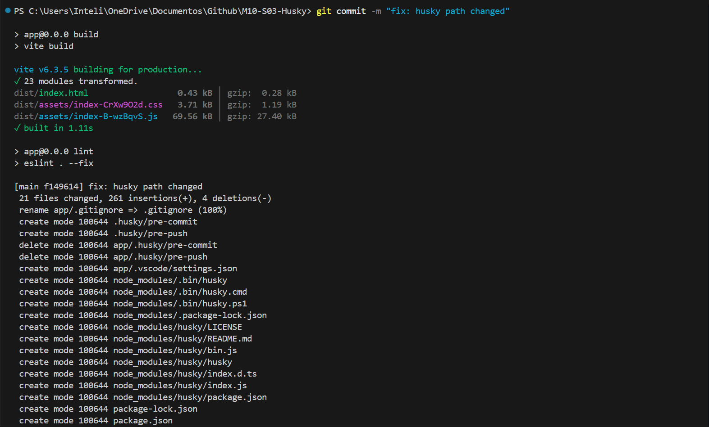
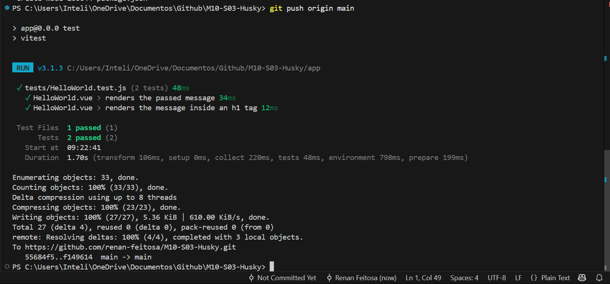

# Husky

&emsp;&emsp;O Husky é uma ferramenta que permite adicionar hooks no Git, permitindo executar scripts personalizados em diferentes pontos do ciclo de vida do Git. Isso é útil para garantir que certas ações sejam executadas antes ou depois de operações do Git, como commits, push e pull.

<br>

## Tecnologias Utilizadas
- **Vue.js**: Framework progressivo para construção de interfaces de usuário.
- **Node.js**: Ambiente de execução JavaScript no lado do servidor.
- **Husky**: Ferramenta para gerenciar hooks do Git.
- **Lint-staged**: Ferramenta para executar linters em arquivos que estão prestes a serem commitados.
- **ESLint**: Ferramenta para identificar e corrigir problemas em código JavaScript.
- **Prettier**: Formatador de código para garantir um estilo consistente.
-**Jest**: Framework de testes para JavaScript.

<br>

## Estrutura de Diretórios

```
M10-S03-Husky/
├── app/
│   ├── src/
│   ├── tests/
│   ├── dist/
│   ├── package.json
│   └── ... (demais arquivos)
├── .husky/
│   ├── pre-commit
│   └── _/ (scripts internos do husky)
└── README.md
```

<br>

## Processo de Instalação
1. **Instalação do Husky**: Execute o seguinte comando para instalar o Husky como uma dependência de desenvolvimento:
   ```bash
   npm install --save-dev husky
   ```
2. **Ativação do Husky**: Após a instalação, ative o Husky com o seguinte comando:
   ```bash
    npx husky init
    ```

3. **Configuração do Husky**: O comando acima criará um diretório `.husky` na raiz do seu projeto, onde você pode adicionar hooks personalizados. Por exemplo, para adicionar um hook `pre-commit`, execute:
    ```bash
    echo "npm test" > .husky/pre-commit
    ```

4. **Testando o Hook**: Após adicionar o hook, faça um commit para verificar se o hook está funcionando corretamente. O Husky executará o comando definido no hook antes de permitir o commit.

<br>

## Screenshots

### Pre-commit Hook
```bash
cd app && npm run build && npm run lint && cd ..
```



### Pre-push Hook
```bash
cd app && npm run test && cd ..
```
